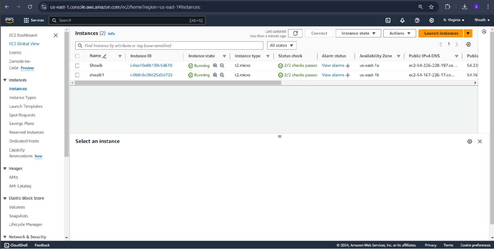
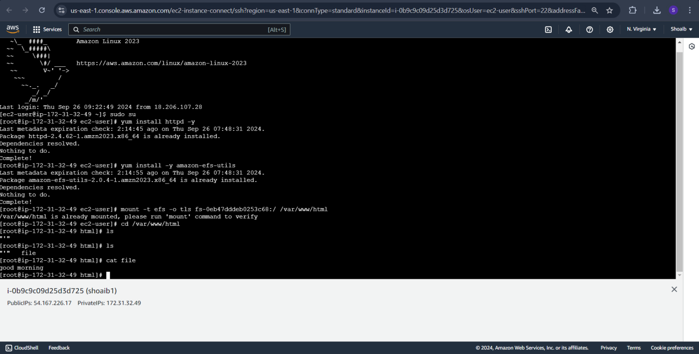
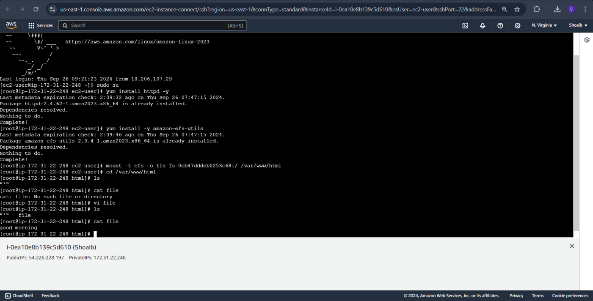
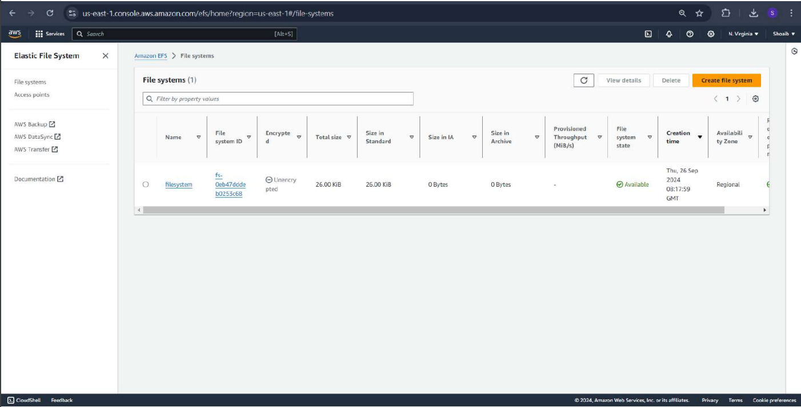
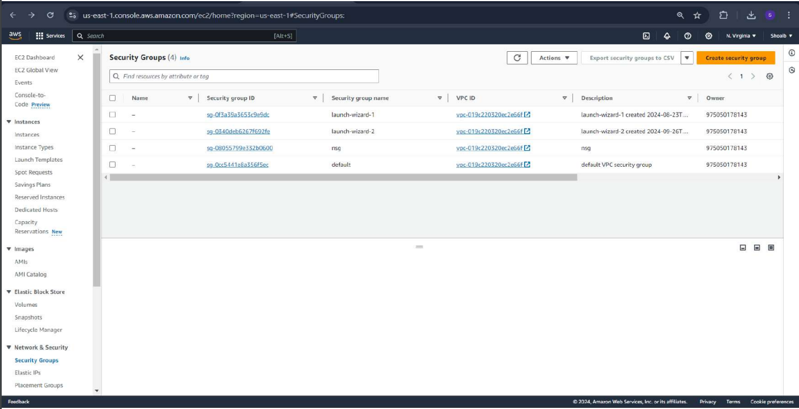
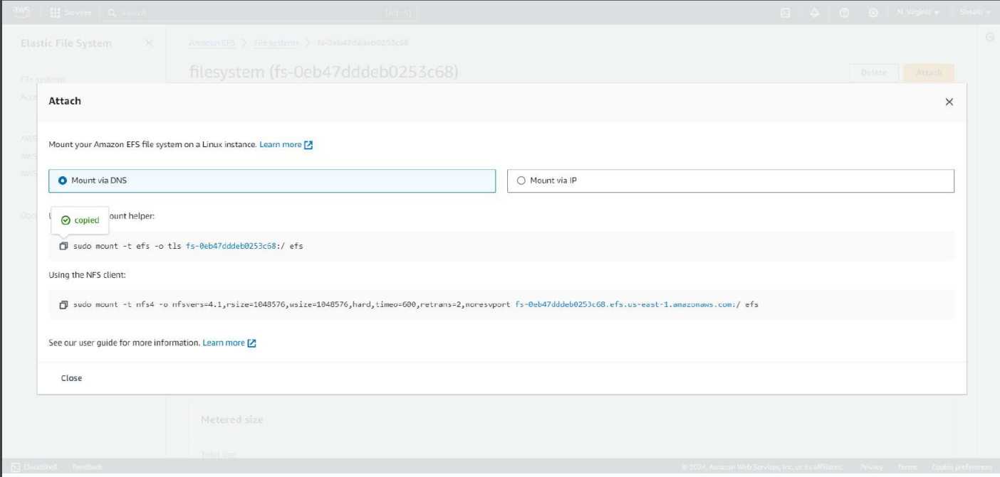

# SETTING UP A SCALABLE FILE STORAGE SYSTEM USING AMAZON ELASTIC FILE SYSTEM
## AIM :
To set up a scalable file storage system using Amazon Elastic File System (EFS) for two EC2 instances in different availability zones, enabling shared access to data.

## PROBLEM STATEMENT :
This experiment demonstrates how to configure Amazon EFS to provide a shared storage solution for two Linux EC2 instances across different availability zones, enabling easy data sharing. The aim is to ensure both instances can mount and access the EFS file system and validate data consistency across instances.

## ALGORITHM :
Step 1: Launch Two EC2 Instances in Different Availability Zones
Go to the EC2 service in the AWS Management Console.
Launch two Linux-based EC2 instances (e.g., Amazon Linux 2) and place them in different availability zones within the same VPC.
Assign each instance a security group that allows NFS access on port 2049.

Step 2: Set Up Security Group for EFS
Create or configure a security group that allows inbound NFS traffic on port 2049 from the security group of both EC2 instances.
Attach this security group to the EFS file system to permit access from both instances.

Step 3: Create an EFS File System
In the AWS Console, navigate to the EFS service and select Create file system.
Select the same VPC as your EC2 instances and configure mount targets in the availability zones where your instances are located.
Complete the setup and take note of the file system ID (e.g., fs-064645ac116a12816).

Step 4: Configure EC2 Instances to Access EFS

Instance 1
1. SSH into the first EC2 instance.
2. Switch to superuser
3. Install the HTTP server and EFS utilities
4. Mount the EFS file system to the web server's root directory
5. Navigate to the mounted directory and create a sample file:

Instance 2
1. SSH into the second EC2 instance.
2. Switch to superuser
3. Install the HTTP server and EFS utilities
4. Mount the EFS file system to the web server's root directory
5. Navigate to the mounted directory, list files, and view the content of the file created on Instance 1

## COMMANDS :
```
EC2 Instance 1
sudo su
yum install httpd -y
yum install -y amazon-efs-utils
mount -t efs -o tls fs-064645ac116a12816:/ /var/www/html
cd /var/www/html
vi file  # Create a file and add some text
EC2 Instance 2
sudo su
yum install httpd -y
yum install -y amazon-efs-utils
mount -t efs -o tls fs-064645ac116a12816:/ /var/www/html
cd /var/www/html
ls
cat file  
```

## OUTPUT
### REG NUMBER:212222240094
### NAME: Shaik Shoaib Nawaz







## RESULT
Thus, The setting up a scalable file storage system using Amazon Elastic File System (EFS) for two EC2 instances in different availability zones, enabling shared access to data is executed successfully.
 

  


